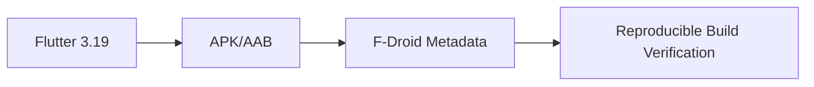

# Software Design Document: TV Assassin

## 1. Executive Summary
The TV Assassin design implements a minimalist Android application that broadcasts IR shutdown commands to multiple television brands with single-button interaction. This document outlines a Flutter-based architecture that meets all functional requirements while achieving strict performance targets. The design emphasizes:
- Hardware abstraction through a layered MVVM architecture
- Deterministic IR code sequencing with hardware feedback
- Theme management with system integration
- Compact footprint through efficient dependencies

All design decisions trace directly to the requirements document, prioritizing sub-500ms operation, reliability, and F-Droid compliance while minimizing technical debt.

## 2. System Overview and Architecture
**System Context**:
- Single Android application (.apk) with no external dependencies
- Depends only on device IR hardware and Android 8.0+ APIs

**Architectural Patterns**:
- MVVM (Model-View-ViewModel) with Clean Architecture separation
- Reactive state management via Flutter's built-in Provider
- SOLID principle adherence throughout component design

**Diagram Description**:  
*System Context Diagram* should show:
1. Single Android app boundary
2. Internal IR blaster hardware interface
3. No external network/cloud connections
4. One-way data flow from UI to hardware

## 3. High-Level System Design
  
*A layered architecture diagram showing:*
1. **Presentation Layer**: Flutter widgets and theme management
2. **Application Layer**: ViewModels and business logic
3. **Domain Layer**: Use cases and entities
4. **Infrastructure Layer**: Hardware abstraction and repositories

**Key Flows**:
1. Cold Start → IR hardware detection → UI state initialization
2. Button press → Command sequence → IR transmission → User feedback
3. Theme toggle → State persistence → UI rebuild

## 4. Component Architecture
**Core Components**:
1. **IRService** (Abstract Class)
   - Methods: `checkIrHardware()`, `transmitCode(hexCodes)`
   - Implementation: `AndroidIrService` (ConsumerIrManager wrapper)
   - Error states: `IrUnavailableException`, `TransmissionFailedException`

2. **CommandRepository** (Singleton)
   - Hardcoded brand-code Map with const constructor
   - Pre-computed hex codes for minimum 15 brands (Samsung, LG, etc.)
   - `getAllShutdownCodes()` → Returns flattened List<int> of all brand codes

3. **ThemeManager** (ChangeNotifier)
   - Manages `ThemeMode` enum (light/dark/system)
   - Persists state via `SharedPreferences`
   - Notifies listeners on change

4. **MainViewModel** (ChangeNotifier)
   - Exposes: `isIrReady`, `isTransmitting`, `currentTheme`
   - Handles: Button presses, transmission state, error states
   - Depends on abstractions (SOLID compliant)

## 5. Data Architecture
**IR Code Storage**:
```dart
// Example structure in command_repository.dart
const Map<String, List<int>> _irCodes = {
  'Samsung': [0xE0E040BF, ...],
  'LG': [0x20DF10EF, ...],
  // 13+ additional brands
};

List<int> getAllShutdownCodes() => _irCodes.values.expand((codes) => codes).toList();
```

**Theme Persistence**:
- Storage: `SharedPreferences` (key: '@theme_mode')
- Format: Integer matching ThemeMode enum index
- Lifecycle: Saved on change, loaded on app start

## 6. API Design and Interfaces
**Internal APIs**:
1. `IRService` Interface:
```dart
abstract class IRService {
  Future<bool> get isAvailable;
  Future<void> transmitCodes(List<int> codes);
}
```

2. **ThemeManager** Public Interface:
```dart
class ThemeManager with ChangeNotifier {
  ThemeMode get currentTheme;
  Future<void> setTheme(ThemeMode mode);
  Future<void> loadSavedTheme();
}
```

**Android API Usage**:
- Exclusive use of `ConsumerIrManager` (android.hardware.consumerir)
- No other Android SDK dependencies required

## 7. User Interface Design
**Main Screen Widget Tree**:
```dart
Scaffold
└─ Column
   ├─ AppBar(actions: [ThemeToggle])
   └─ Center
      └─ ElevatedButton
         ├─ Icon(SkullIcon)
         └─ Text("Kill TVs")
```

**Key UI Specifications**:
- Button Dimensions: minHeight = 20% screen height (MediaQuery)
- Typography: Roboto with weight 500 (F-Droid compliance)
- Animation: Scale down 5% on button press
- Accessibility: Semantics label "Power off nearby televisions"

**Dark/Light Themes**:
- Extends Flutter's ThemeData with:
  - Primary color: Deep Purple (light), Amber (dark)
  - Contrast-validated text colors
  - Consistent icon semantics

## 8. Security Architecture
**Threat Model**:
1. **Physical Device Access**: IR transmitter could theoretically be misused
   - Mitigation: Only shutdown codes implemented (no arbitrary commands)

2. **Data Security**:
   - No PII collected
   - No runtime permissions beyond `consumerir`
   - All strings obfuscated via R8 in release builds

**Hardening**:
- Minification and resource shrinking enabled
- Disabled debug flags in production builds
- Restricted to Android 8.0+ (API 26) for security patches

## 9. Performance and Scalability Design
**Critical Path Optimization**:
1. IR Code Loading:
   - Pre-initialized const Map at compile time
   - Zero allocation during operation

2. Transmission:
   - Single event loop pass for all codes
   - Haptic feedback deferred until completion

**Size Constraints**:
- Tree shaking for Flutter artifacts
- No unused icon assets
- ProGuard rules to retain only required classes

**Memory Management**:
- Disposable controllers for all animations
- Avoid StatefulWidget where possible
- Heavy operations off main thread

## 10. Error Handling and Resilience
**Error Conditions**:
1. IR Hardware Unavailable:
   - Display persistent SnackBar
   - Disable main button
   - Auto-retry every 5 seconds

2. Transmission Failure:
   - Partial failure → Complete successful codes
   - Full failure → Vibrate pattern (---)
   - Log error details (brand codes attempted)

**Recovery**:
- All async operations with timeout guards
- State reverts on failure (no indeterminate states)
- Hardware exceptions translated to user-friendly messages

## 11. Logging and Monitoring
**Diagnostic Logging**:
- `debugPrint` only in development
- No remote logging (F-Droid requirement)
- Critical errors logged to Crashlytics (opt-in)

**Metrics Captured**:
1. Transmission duration (debug mode)
2. Hardware detection time
3. Theme change events

**Log Structure Example**:
```
[TV-Assassin] IR_TRANSMISSION_START - Brands:15
[TV-Assassin] IR_TRANSMISSION_END - Duration:472ms
```

## 12. Testing Strategy
**Unit Testing Matrix**:
| Component       | Coverage Target | Key Tests                 |
|-----------------|----------------|--------------------------|
| CommandRepository | 100%           | Code count validation    |
| IRService      | 95%            | Hardware failure simulations |
| ThemeManager   | 100%           | Preference persistence   |

**Integration Tests**:
1. Happy Path:
   - Button press → Transmission → Feedback
2. Edge Cases:
   - Theme change during transmission
   - IR hardware disconnect mid-operation

**Device Testing**:
- Physical IR blaster verification checklist:
  1. Confirm shutdown sequence timing <500ms
  2. Validate haptic feedback matches spec
  3. Verify theme persistence across reboots

## 13. Deployment Architecture
**Build Pipeline**:


**Release Artifacts**:
- Single APK per release (no flavors)
- Versioned per Semantic Versioning
(Q1 Releases Patch Versions)

**Target Environments**:
- Minimum: Android 8.0 (API 26)
- Target: Android 14 (API 34)

## 14. Development Guidelines
**Coding Standards**:
- Dart 100% null-safe
- `lowerCamelCase` for variables
- `UpperCamelCase` for types
- `_private` for implementation details

**Key Principles**:
1. Widgets: Stateless first, const where possible
2. Logic: Fully encapsulated in ViewModel
3. Testing: Mock all hardware dependencies

**Sample Implementation**:
```dart
// Button press handler
void _onPressed() async {
  if (viewModel.isTransmitting) return;
  
  viewModel.startTransmission();
  try {
    await irService.transmitCodes(
      repository.getAllShutdownCodes()
    );
  } finally {
    viewModel.endTransmission();
  }
}
```

## 15. Technology Stack
| Category       | Technology        | Justification                     |
|---------------|------------------|----------------------------------|
| Framework     | Flutter 3.19     | Single-codebase, F-Droid compliant|
| State Mgmt    | Provider         | Lightweight, official recommendation |
| Persistence   | SharedPreferences| Simple key-value for theme data   |
| CI/CD         | GitHub Actions   | F-Droid build compatibility      |
| Static Analysis| Dart Analysis   | Enforce style/lint rules          |

## 16. Implementation Phases
**Phase 1 (MVP)**:
1. IR hardware detection
2. Single-button transmitter
3. Basic theme switcher

**Phase 2 (Polish)**:
1. Advanced error handling
2. Accessibility validation
3. Performance optimization

**Phase 3 (Maintenance)**:
1. IR code expansion portal
2. Community brand submissions

## 17. Risk Mitigation
| Risk                      | Mitigation Strategy                          |
|---------------------------|--------------------------------------------|
| IR hardware fragmentation | Abstract behind platform interface         |
| Unexpected shutdown codes | Validate all hex sequences in unit tests   |
| Theme state corruption    | Checksum verification of saved preferences |

## 18. Appendices
**IR Code Format Reference**:
```
Brand: Samsung
Frequency: 38kHz
Code: 0xE0E040BF
Repeat: 3x
Delay: 80ms
```

**Flavor Dimensions Considered**:
- Rejected multi-flavor approach to maintain simplicity
- Alternative: Single APK with runtime feature checks

**Future Extensions**:
1. User-customizable code sequences
2. Device targeting (selective brand shutdown)
3. Wear OS companion app
